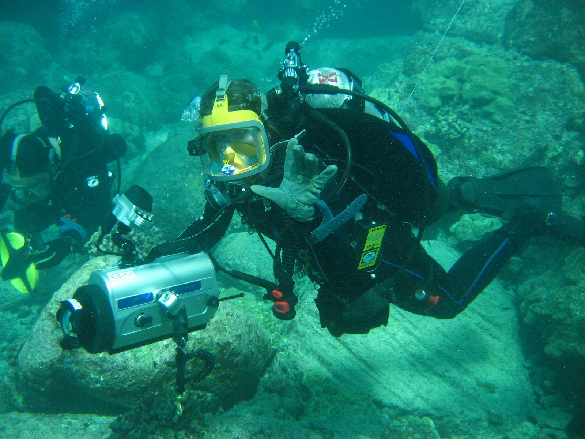
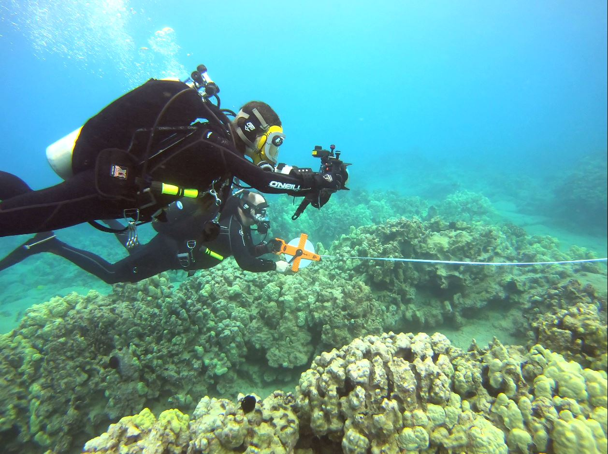

# Seattle_Aquarium_Hawaii_coral_reef_fish_monitoring
This repository contains all code and data associated with "A novel underwater survey method documents changes in abundance, richness, and community structure of Hawaiʹi reef fishes"

  
   

  
   

